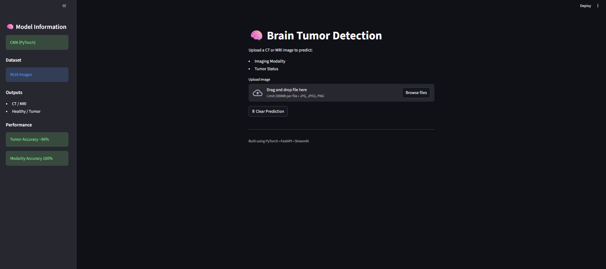
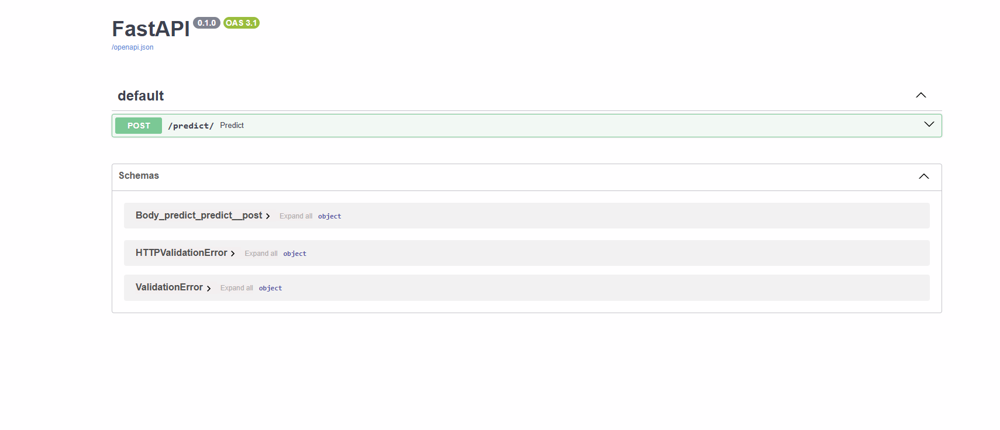
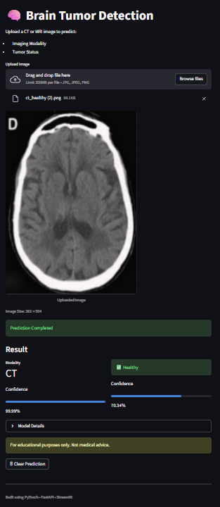

# 🧠  Brain Tumor Detection using Deep Learning (PyTorch)

An end-to-end Deep Learning application for detecting brain tumors from CT and MRI images using Convolutional Neural Networks (CNN) built with PyTorch.

The system predicts:

✅ Imaging Modality → CT / MRI  
✅ Tumor Status → Healthy / Tumor  

The project includes:

- Model Training
- Image Prediction
- FastAPI Backend
- Streamlit Web Interface
- GitHub Deployment Workflow

---

# 📌 Project Overview

This application uses medical imaging data to automatically classify:

- Brain Scan Type (CT / MRI)
- Tumor Presence (Healthy / Tumor)

The model was trained using supervised learning and deployed through a user-friendly web interface.

---

# 🚀 Features

- CT / MRI Classification
- Healthy / Tumor Detection
- Real-time Image Upload
- Confidence Score Prediction
- FastAPI REST API
- Streamlit Interactive UI
- End-to-End ML Pipeline

---

# 📂 Dataset

Dataset Size:

9618 Images

Classes:

- CT Healthy
- CT Tumor
- MRI Healthy
- MRI Tumor

---

# 🏗 Model Architecture

Model:

CNN (Convolutional Neural Network)

Input:

64 × 64 RGB Image

Output:

2 Labels

1. Modality
   - CT
   - MRI

2. Tumor Status
   - Healthy
   - Tumor

---

# 🛠 Tech Stack

- Python
- PyTorch
- FastAPI
- Streamlit
- NumPy
- PIL
- Matplotlib

---

# 📈 Results

Tumor Detection Accuracy:

96%

Tumor F1 Score:

0.95

Tumor Recall:

98–99%

Modality Accuracy:

100%

---

# 🖼 screenshots

## Streamlit Interface



---

## FastAPI Backend



---

## Prediction Example



---

# ⚙ Installation

Clone Repository

```bash
git clone YOUR_REPO_LINK
```

Install Dependencies

```bash
pip install -r requirements.txt
```

---

# ▶ Run Project

Train Model

```bash
python train.py
```

Run FastAPI

```bash
uvicorn app.main:app --reload
```

Run Streamlit

```bash
streamlit run app/streamlit_app.py
```

Open:

```text
http://localhost:8501
```

---

# 📁 Project Structure

```text
BTD-CT_MRI
│
├── app
├── model
├── utils
├── screenshots
├── train.py
├── test_predict.py
├── README.md
├── requirements.txt
```

---

# 🔮 Future Improvements

- Transfer Learning
- Explainable AI (Grad-CAM)
- Cloud Deployment
- Improved Generalization
- Multi-class Tumor Classification

---

# ⚠ Disclaimer

This project is developed for educational and research purposes only and is not intended for medical diagnosis.